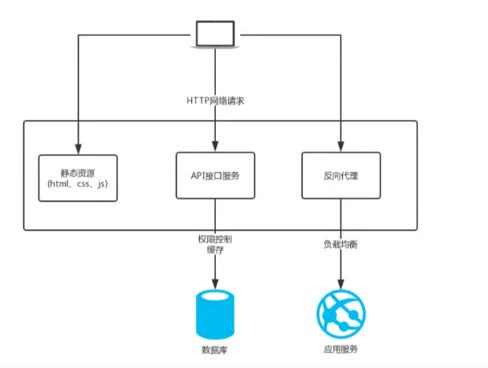

### 场景
1.静态资源服务器
2.反向代理服务  -- 权限控制缓存
3.api接口服务  -- 负载均衡
```js

```

### 优势
* 高并发高性能
* 可扩展性好
* 高可靠性
* 热部署 -- 更新后不需要重启服务
* 开源许可证

### nginx的架构
+ 轻量
  - 源代码只包含核心模块
  - 其他非核心功能都是通过模块实现，可以自由选择
+ 架构
  - 多进程（单线程）和I/O多路复用